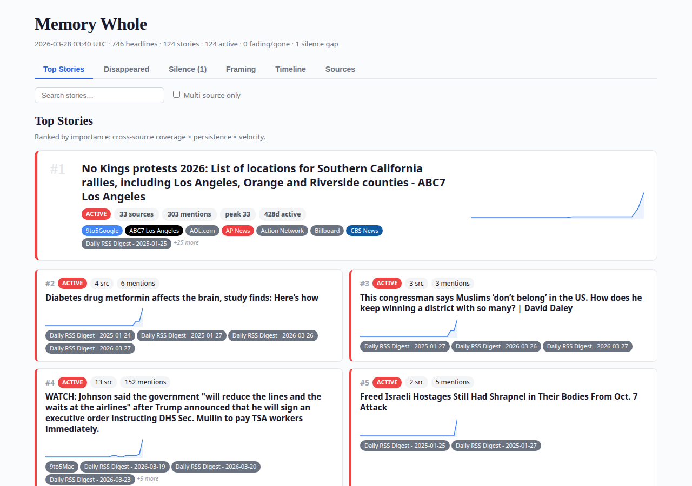

<p align="center">
  <strong>🧰 Memory Whole</strong><br>
  <em>What the news forgets, Memory Whole remembers.</em>
</p>

> **Why "Memory Whole"?** — In Orwell's *1984*, the _memory hole_ is where
> inconvenient facts are destroyed. Memory Whole flips the name: instead of
> erasing the record, it keeps the **whole** picture — tracking which stories
> the media amplifies, buries, and quietly lets disappear.

<p align="center">
  
  
  
  
  
</p>

---

<p align="center">
  
</p>

Memory Whole is a self-hosted news intelligence tool. It fetches headlines from **36 sources** across the political spectrum, clusters them into stories using machine learning, and tracks how those stories rise, persist, and vanish from the news cycle. It detects **silence gaps** — stories one side of the media covers but the other ignores — and can alert you when significant stories disappear. Everything is served as a single-page dashboard you can run with one command.

## Why?

Every news outlet decides what to amplify and what to bury. Memory Whole doesn't editorialize — it **remembers**. It watches 36 RSS feeds spanning left, center, and right, then answers questions like:

- Which stories are **every** outlet covering right now?
- What was huge yesterday but **disappeared** today?
- Which outlets are covering something that **nobody else** is?
- Is the **left** or **right** ignoring a story the other side is pushing?
- How long did a story stay in the news before it was gone?

## How It Works

```
   RSS Feeds (36 sources, classified by political lean)
         │
         ▼
   ┌───────────┐     ┌──────────┐     ┌──────────────┐
   │  Fetcher   │────▶│ SQLite   │────▶│   Tracker    │
   │ feedparser │     │ every    │     │ TF-IDF +     │
   │            │     │ headline │     │ DBSCAN       │
   └───────────┘     └──────────┘     └──────┬───────┘
                                              │
                       story lifecycle:       │
                       active → fading → gone │
                                              ▼
                                     ┌────────────────┐
                                     │   Dashboard    │
                                     │  7-tab HTML    │
                                     └───────┬────────┘
                                              │
                              ┌───────────────┼───────────────┐
                              ▼               ▼               ▼
                       ┌───────────┐   ┌───────────┐   ┌───────────┐
                       │  Silence  │   │  Alerts   │   │  Digest   │
                       │ detection │   │   ntfy /  │   │ email /   │
                       │ left vs   │   │  webhook  │   │ ntfy /    │
                       │   right   │   │           │   │  file     │
                       └───────────┘   └───────────┘   └───────────┘
```

**Pipeline:** `fetch → cluster → dashboard → alerts → digest`

Each feed is classified by political lean (`left`, `center-left`, `center`, `center-right`, `right`, `international`), which powers silence detection — the core of what Memory Whole tracks.

### Modules

| Module | Role |
|---|---|
| `fetcher.py` | Pulls RSS/Atom feeds, validates config, tracks per-feed health, upserts into SQLite |
| `db.py` | Schema, queries, daily snapshots — the permanent memory |
| `tracker.py` | Clusters headlines via TF-IDF + DBSCAN, manages story lifecycle, detects merge events |
| `dashboard.py` | Generates the 7-tab HTML dashboard with tiered story layout, dark mode, and mobile support |
| `silence.py` | Detects stories covered by one political side but ignored by the other |
| `framing.py` | Detects sentiment divergence — same story, different tone left vs. right |
| `alerts.py` | Push notifications (ntfy.sh) and webhooks when stories disappear |
| `digest.py` | Daily summary via ntfy, email (SMTP), and local file |
| `utils.py` | Slugify, color/lean mappings, favicon lookups |
| `rss_reader.py` | CLI entry point that orchestrates the full pipeline |

### Dashboard

The dashboard has seven tabs:

| Tab | What it shows |
|---|---|
| **Top Stories** | Tiered layout: hero card (#1), grid (#2–6), compact list (#7+) — ranked by cross-source coverage × persistence × velocity, with rising/falling trend badges |
| **Disappeared** | Stories that were big but dropped off — the memory hole in action |
| **Silence** | Stories one political side covers but the other ignores, with source pills showing who's covering |
| **Framing** | Stories where left and right use starkly different tone — sentiment bars, divergence scores, and sample headlines from each side |
| **Timeline** | Heatmap of story coverage over time — darker cells = more sources that day |
| **Sources** | Matrix showing which outlets covered which stories — gaps reveal editorial blind spots |
| **Feeds** | Per-feed health status: success/failure, items fetched, response time, and errors |

Each story has a detail page with a full sparkline chart, every headline that matched, and daily coverage snapshots.

### Additional Features

- **Dark mode** — toggle with the ☽/☀ button; remembers your preference via localStorage, and auto-detects system preference
- **Mobile responsive** — fully usable on phones and tablets (breakpoints at 768px and 480px)
- **Velocity badges** — each story shows whether it's rising, cooling, falling, or new compared to recent days
- **Feed validation** — on startup, validates every feed in your config for required fields, URL format, duplicates, and valid lean values
- **Feed health monitoring** — tracks per-feed success/failure, response time, items fetched, and error messages
- **Story merge detection** — detects and logs when previously separate stories converge into one
- **JSON API** — writes `api.json` alongside the dashboard with top stories, disappeared stories, and stats for external tools

### Feeds

36 sources across the political spectrum:

| Lean | Sources |
|---|---|
| **Left** | MSNBC, HuffPost, Mother Jones, The Intercept, Democracy Now |
| **Center-Left** | CNN, PBS NewsHour, NPR, NY Times, Washington Post, Vox, The Guardian US |
| **Center** | ABC News, CBS News, AP News, Reuters, The Hill, Politico, USA Today, CNBC, Google News |
| **Center-Right** | Wall Street Journal, NY Post, Washington Examiner, RealClearPolitics |
| **Right** | FOX News, National Review, Breitbart, Daily Wire, The Federalist, Drudge Report, Rantingly, Patriots.win |
| **International** | BBC, Al Jazeera, France 24 |

## Quick Start

### Docker (recommended)

```bash
git clone https://github.com/Greg-2600/memory-whole.git
cd memory-whole
cp feeds.example.yaml feeds.yaml   # edit to customize sources
./scripts/docker_up.sh
```

Open **http://localhost:4747** — that's it. The container fetches feeds, clusters stories, builds the dashboard, and serves it. On first run, Memory Whole automatically backpopulates all available historical data from feed archives so you start with days of context instead of a blank slate. A cron job inside the container re-runs the pipeline every 6 hours.

### Local

```bash
python -m pip install -r requirements.txt
python rss_reader.py --max-items 250     # fetch + cluster + dashboard
python -m http.server 4747 --directory output
```

On first run (empty database), the pipeline fetches live feeds **and** backpopulates historical data from RSS archives automatically — no extra flags needed.

## Usage

```bash
# Full pipeline: fetch → cluster → dashboard → alerts → digest
python rss_reader.py --max-items 250

# Dashboard only (skip fetching, use existing DB)
python rss_reader.py --dashboard-only

# Import existing markdown digests into the DB
python rss_reader.py --import-markdown

# Check current status
python rss_reader.py --status
```

### CLI Reference

| Flag | Description |
|---|---|
| `--config` | Path to YAML config (default: `feeds.yaml`) |
| `--output-dir` | Override output directory |
| `--max-items` | Max items fetched per feed |
| `--fetch-only` | Fetch and store headlines, skip tracking/dashboard |
| `--dashboard-only` | Regenerate dashboard from existing DB |
| `--import-markdown` | Import markdown digests into the database |
| `--status` | Print current DB stats and exit |

> **First run:** When the database is empty, the pipeline automatically backpopulates all available historical data from RSS feed archives — typically 2–3 weeks of headlines depending on the feed.

<details>
<summary>Legacy flags (still supported)</summary>

| Flag | Description |
|---|---|
| `--backpopulate` | Generate historical daily files from feed archives |
| `--detect-important` | Run multi-source detection (legacy calendar mode) |
| `--from-markdown` | Load entries from markdown instead of live feeds |
| `--publish` | Write artifacts to the output directory |
| `--watch` | Watch for markdown changes and auto-regenerate |
| `--show-only-multi` | Show only multi-source stories in calendar output |

</details>

## Configuration

Edit `feeds.yaml` to add or remove sources. Each feed needs a `name`, `url`, and `lean` classification:

```yaml
feeds:
  - name: CNN Top Stories
    url: https://rss.cnn.com/rss/edition.rss
    lean: center-left
  - name: FOX News Latest
    url: https://moxie.foxnews.com/google-publisher/latest.xml
    lean: right
  - name: NPR News
    url: https://feeds.npr.org/1001/rss.xml
    lean: center-left
  # ... add any RSS/Atom feed

settings:
  output_dir: output
  max_items_per_feed: 250
  merge_all_sources: true
  merged_filename: "daily-news-{date}.md"
  daily_title: "Daily RSS Digest - {date}"
  write_individual_feeds: false
  summary_max_sentences: 6
  summary_max_words: 300
```

### Silence Detection

Silence detection is enabled by default. It flags stories where one political side has `min_sources_covering` or more sources but the other side has zero:

```yaml
silence:
  enabled: true
  min_sources_covering: 2    # min sources on one side before flagging
  lookback_days: 7           # how far back to check
```

### Framing / Sentiment Divergence

Detects stories where left-leaning and right-leaning outlets use starkly different tone. Uses VADER (rule-based, no GPU required) to score headline sentiment and flags stories exceeding the divergence threshold:

```yaml
framing:
  enabled: true
  min_sources: 3          # story must have ≥ this many sources
  min_divergence: 0.25    # abs(left_avg − right_avg) threshold (0–2 scale)
  lookback_days: 14       # analysis window
```

### Alerts

Get push notifications when significant stories disappear from the news:

```yaml
alerts:
  enabled: true
  ntfy_topic: "my-memory-whole"   # free push via https://ntfy.sh
  min_peak_sources: 3                # only alert for stories this big
  webhook_url: ""                    # optional JSON webhook
```

### Daily Digest

Receive a daily summary of top stories, disappeared stories, and silence gaps:

```yaml
digest:
  enabled: true
  ntfy_topic: "my-mm-digest"   # push notification
  smtp_host: "smtp.gmail.com"  # or leave blank to skip email
  smtp_port: 587
  smtp_user: "you@gmail.com"
  smtp_pass: "app-password"
  smtp_from: "you@gmail.com"
  smtp_to: "you@gmail.com"
```

The digest is always written to `output/digest-YYYY-MM-DD.txt` regardless of delivery settings.

## Docker

### Compose (recommended)

```bash
./scripts/docker_up.sh          # build + start on port 4747
./scripts/docker_down.sh        # stop (output volume preserved)
```

The named volume `mw_output` persists the SQLite database and all generated data across container rebuilds.

The Compose service also pins public DNS resolvers (`1.1.1.1` and `8.8.8.8`) during builds and runtime. That avoids intermittent feed lookup and package resolution failures on hosts with unreliable default Docker DNS.

### Force regeneration

```bash
FORCE_REGEN=1 ./scripts/docker_up.sh
```

When `FORCE_REGEN=1`, the container re-runs the full pipeline on startup regardless of existing data.

### Healthcheck

The container includes a built-in healthcheck:

```bash
docker compose ps                    # shows health status
docker compose logs memory_whole  # check for errors
```

### Run without Compose

```bash
# Dev mode — mount local output/ for live changes
docker run --rm -p 4747:4747 -v "$(pwd)/output:/app/output" memory_whole:latest

# Force regen
docker run --rm -e FORCE_REGEN=1 -p 4747:4747 -v "$(pwd)/output:/app/output" memory_whole:latest
```

## Output

All artifacts are written to `output/`:

| File | Description |
|---|---|
| `memory_whole.db` | SQLite database (WAL mode) — every headline ever fetched |
| `index.html` | Main dashboard (7-tab UI with dark mode) |
| `story_*.html` | Per-story detail pages with sparkline charts and headline lists |
| `api.json` | JSON export of top stories, disappeared stories, and stats |
| `digest-YYYY-MM-DD.txt` | Daily digest summary |
| `daily-news-YYYY-MM-DD.md` | Daily merged digest (Markdown) |
| `calendar.html` | Redirect to index.html (backward compat) |

## Project Structure

```
memory_whole/
├── rss_reader.py           # CLI entry point — orchestrates the full pipeline
├── fetcher.py              # RSS fetch + normalize + store
├── db.py                   # SQLite schema, queries, snapshots
├── tracker.py              # TF-IDF + DBSCAN clustering, story lifecycle
├── dashboard.py            # HTML dashboard generator (7 tabs, tiered layout)
├── silence.py              # Silence gap detection (left vs. right coverage)
├── framing.py              # Sentiment divergence (VADER, left vs. right tone)
├── alerts.py               # Disappearance alerts (ntfy, webhooks)
├── digest.py               # Daily digest (ntfy, email, file)
├── utils.py                # Shared helpers (colors, leans, slugify)
├── feeds.yaml              # Feed configuration (36 sources)
├── feeds.example.yaml      # Example config for new users
├── Dockerfile              # Container image
├── docker-compose.yml      # One-command deployment
├── pyproject.toml          # Project metadata
├── requirements.txt        # Runtime dependencies
├── requirements-dev.txt    # Dev/lint dependencies
├── scripts/
│   ├── docker_up.sh        # Start via Compose
│   ├── docker_down.sh      # Stop via Compose
│   ├── docker_entrypoint.sh
│   ├── container_cron      # Cron schedule (every 6 hours)
│   ├── run.sh              # Helper for common operations
│   └── ...
├── tests/                  # 124 tests (pytest)
│   ├── test_db.py
│   ├── test_fetcher.py
│   ├── test_tracker.py
│   ├── test_dashboard.py
│   ├── test_silence.py
│   ├── test_framing.py
│   ├── test_alerts.py
│   ├── test_digest.py
│   └── ...
└── output/                 # Generated artifacts (gitignored)
```

## Development

```bash
python -m pip install -r requirements-dev.txt

# Format
python -m black .

# Lint + static analysis
python -m ruff check .
python -m pylint $(find . -name '*.py' -not -path './.venv/*' -not -path './tests/*')
python -m bandit -r . --exclude ./.venv,./tests -ll

# Test (124 tests)
python -m pytest tests/ -v
```

For a full pre-push verification pass:

```bash
python -m black --check .
python -m ruff check .
python -m pylint $(find . -name '*.py' -not -path './.venv/*' -not -path './tests/*')
python -m bandit -r . --exclude ./.venv,./tests -ll
python -m pytest -q
```

## Requirements

- **Python 3.10+**
- **Runtime:** `feedparser`, `PyYAML`, `vaderSentiment`
- **Clustering:** `scikit-learn`, `numpy` (installed automatically in Docker)
- **Docker** (optional, recommended for production)

## Troubleshooting

| Problem | Solution |
|---|---|
| Empty dashboard | First run backpopulates automatically; if still empty, run again with `--max-items 500` or wait for the next cron cycle |
| No silence gaps | Need at least `min_sources_covering` sources on one side — will appear as more data accumulates |
| Clustering fails | Install `scikit-learn` and `numpy` (`pip install scikit-learn numpy`) |
| Container unhealthy | Check logs: `docker compose logs memory_whole` |
| Port conflict | Change the port mapping in `docker-compose.yml` or pass `-p XXXX:4747` |
| Config errors | Ensure `feeds.yaml` exists with a non-empty `feeds` list, each with `name`, `url`, and `lean` |
| Alerts not sending | Set `alerts.enabled: true` in `feeds.yaml` and provide an `ntfy_topic` or `webhook_url` |

---

<p align="center">
  <em>What the news doesn't want you to remember, Memory Whole never forgets.</em>
</p>
